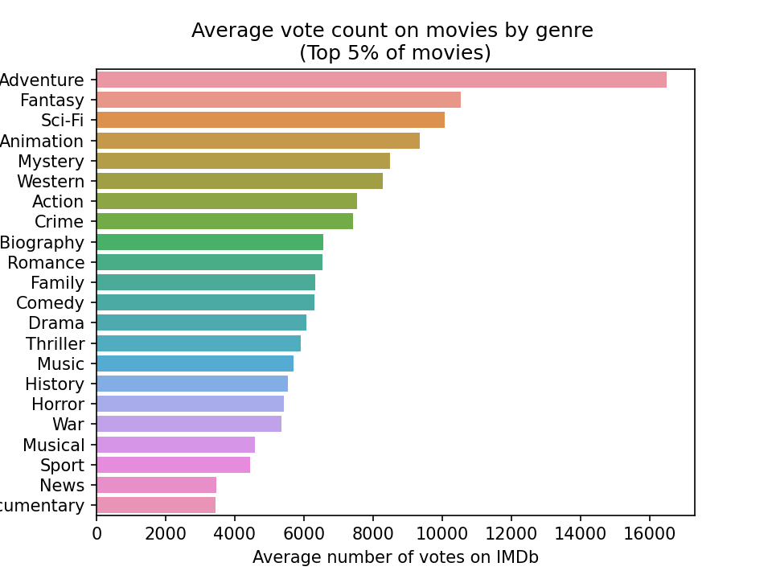
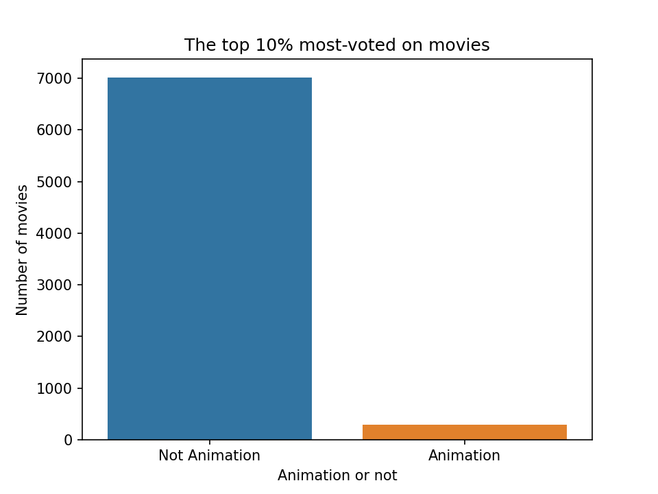
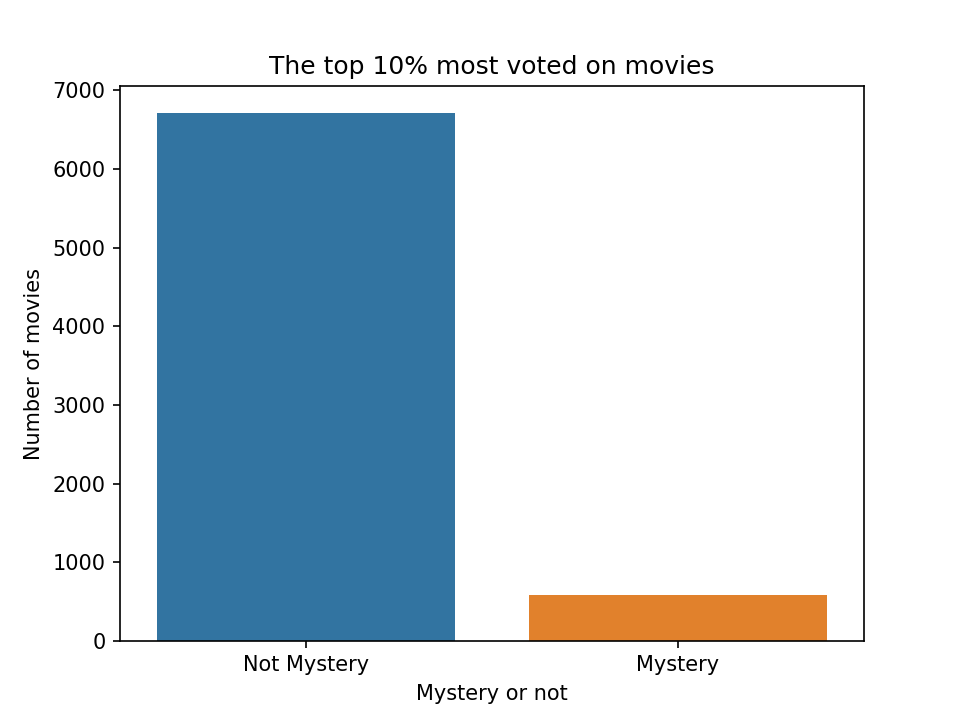

# MOVIE INDUSTRY RESEARCH.
**Authors:** Susan Nduta Kanyora.

## Overview
Production companies in the entertainment industry need to keep up with current trends, such as the shift towards movie streaming instead of theater-going. With the rise of streaming sites like Netflix and Amazon Prime Video, analyzing consumer behavior can inform decisions on popular movie genres, average ratings, and viewing time.

## Business Problem
The goal is to provide insights into the popularity of movies, helping production companies make informed decisions on which types of movies to invest in. The data questions focus on identifying the highest-rated movies and genres, understanding the relationship between budget and revenue, identifying top directors, and tracking trends in ratings and revenue over time. Answering these questions can help production companies allocate resources effectively and make data-driven decisions for success.

## Data Understanding
The project uses data from the zipped IM.db database to answer questions about movie ratings, genres, budget, revenue, directors, and time. The dataset includes a mix of categorical and numerical variables, representing a sample of movies from different countries and languages. The target variable depends on the specific question being asked, such as movie ratings for the highest-rated movies question and runtimes for the genre and average ratings question. The range and distribution of values for each variable will also be considered during the data analysis.

## Data Preparation
Data preparation involves cleaning and transforming the data to make it suitable for analysis, integrating data from multiple sources, and handling missing values or outliers. This ensures the accuracy and quality of the analysis. By dropping irrelevant variables and creating new ones, we focus on the important variables. Handling missing values and outliers reduces bias and improves reliability. Integrating data from multiple sources creates a more comprehensive dataset for a complete view of the problem.

## Measure of success.
The preferred method of measuring a movie's success is through the number of votes, which is more reliable than box office returns in the era of streaming. Research shows that there is a positive correlation between the number of votes and a movie's average rating, making it a good measure of success. The repository includes a list of contents, and instructions for using them are provided in the next section.

## Results 
Based on the top 5% average vote count on movies by genre:

Adventure movies got the highest number of average votes.

Of the top 10% best-performing movies, 287 out of 7,304, — or 3.93% — are animated.

Of the top 10% best-performing movies, 587 out of 6,716, are mysteries.

## Conclusions
Focus on producing movies in the top genres, which are Adventure, Fantasy, Sci-Fi, Animation, and Mystery. It is also important to consider other genres to prevent customers from switching to other streaming services.
